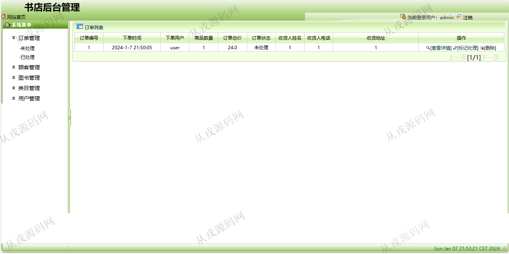
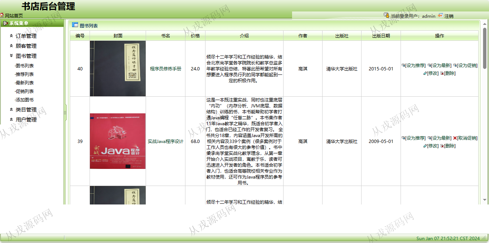
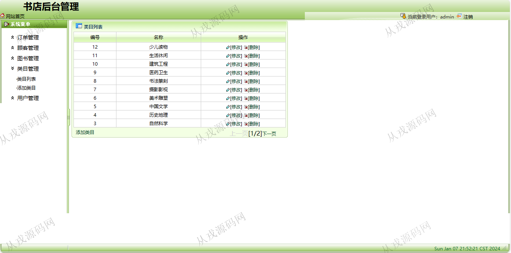

<h1 align="center">122.图书商城管理系统</h1>

 获取sql文件 QQ: 386869957 QQ群: 377586148 

 [推荐站点: 从戎源码网](https://armycodes.com/) 

## 简介

> 本代码来源于网络,仅供学习参考使用!
>
> 提供1.远程部署/2.修改代码/3.设计文档指导/4.框架代码讲解等服务
> 
> 用户端地址：http://localhost:8080/index/index.action
> 
> 用户：user 123456
> 
> 管理后台地址：http://localhost:8080/admin/login.jsp
> 
> 管理员：admin 123456
>

## 项目介绍
基于ssh的图书商城管理系统：前端 jsp、js，后端 struts、spring、hibernate，角色分为管理员、用户；集成图书浏览，购物车，在线购买等功能于一体的系统。

## 功能介绍

### 用户

- 基本功能：登录、注册、退出
- 网站首页：图书全局搜索，精品推荐，书店简介，最新出版，优惠促销，图书分类导航
- 图书购买：图书列表展示，图书详情，购物车，填写收货地址，在线购买
- 我的订单：订单列表查询

### 管理员

- 订单管理：前台用户购买图书下单记录，后台管理员查看订单列表，对订单信息进行标记处理和删除
- 顾客管理：顾客列表查询，顾客由用户在前台自行注册，对已注册用户信息修改，删除，重置密码，也可以在后台由管理员创建
- 图书管理：图书信息的增删改查，推荐列表，最新列表，促销列表，封面上传，设为推荐，设为最新，设为促销
- 类目管理：类目信息的增删改查
- 系统用户管理：系统用户信息的添加，此处添加的用户只能在管理后台登录使用

## 环境

- <b>IntelliJ IDEA 20021.3</b>

- <b>Mysql 5.7.26</b>

- <b>Tomcat 7.0.73</b>

- <b>JDK 1.8</b>

## 运行截图

